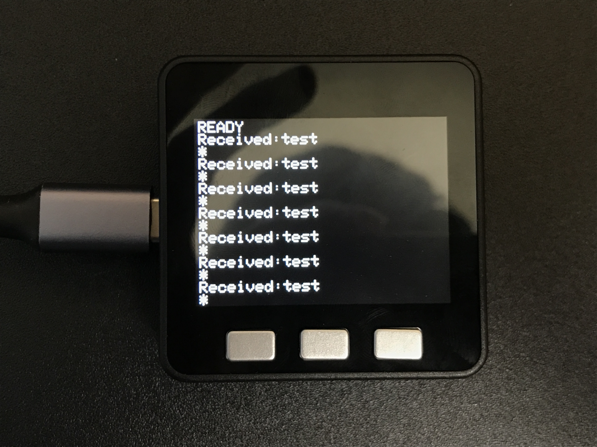

# M5 Stack Serial Sample

This is an example of communicating with PC and M5Stack.

## Prerequisite

You need following items.

- [M5Stack Basic](https://www.switch-science.com/catalog/3647/)
- USB Type C Cable
- PC: nodejs(tested with 14.\*)
- PC: [Arduino IDE](https://www.arduino.cc/en/software)

```
PC(GatewayApp) <--> M5 Stack(M5StackApp)
```

## Check mount path of the M5 Stack

Connect your M5 Stack to your PC via USB Type-C Cable.
And find the mount path of it.

```
$ls /dev/cu*
/dev/cu.usbserial-023EDE0D
```

## Run

### M5 Stack

Build & Deploy [M5StackApp](M5StackApp/sketch_m5stack_serial.ino).
If you succeed in the deployment, you will see "READY" test in the M5 Stack display.

### PC

```
cd GatewayApp
npm install
nodejs index.js
```

## Reference


